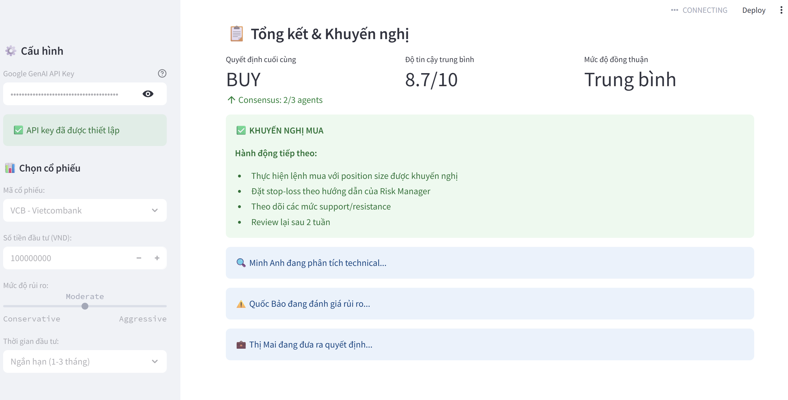

# 🇻🇳 Duong AI Trading SIUUUUU

[](https://python.org)
[](https://fastapi.tiangolo.com)
[](https://streamlit.io)
[](https://ai.google.dev)

> **Hệ thống phân tích đầu tư chứng khoán thông minh với 6 AI Agents + Gemini Chatbot**

## 🎯 Tổng quan

**Duong AI Trading SIUUUUU** là một hệ thống phân tích đầu tư chứng khoán hoàn chỉnh, tích hợp 6 AI Agents chuyên nghiệp và Gemini Chatbot để cung cấp phân tích toàn diện cho thị trường chứng khoán Việt Nam.

### ✨ Tính năng chính

- 🤖 **6 AI Agents chuyên nghiệp**
- 🧠 **Gemini AI Chatbot** tương tác tự nhiên
- 📰 **CrewAI Real News** - Tin tức thật từ các nguồn VN
- 📊 **Dữ liệu real-time** từ thị trường VN
- 🚀 **FastAPI Backend** + **Streamlit Frontend**
- 📈 **Phân tích kỹ thuật & cơ bản**
- ⚠️ **Quản lý rủi ro thông minh**

## 🤖 Đội ngũ 6 AI Agents

| Agent | Chức năng | Mô tả |
|-------|-----------|-------|
| 📈 **PricePredictor** | Dự đoán giá | Phân tích xu hướng và dự báo giá cổ phiếu |
| 📰 **TickerNews** | Tin tức cổ phiếu | Thu thập và phân tích tin tức theo mã |
| 🌍 **MarketNews** | Tin tức thị trường | Cập nhật tin tức thị trường tổng thể |
| 💼 **InvestmentExpert** | Chuyên gia đầu tư | Phân tích cơ bản và khuyến nghị đầu tư |
| ⚠️ **RiskExpert** | Quản lý rủi ro | Đánh giá và quản lý rủi ro đầu tư |
| 🧠 **GeminiAgent** | AI Chatbot | Tương tác tự nhiên với Gemini AI |
| 🤖 **CrewAI News** | Tin tức thật | Thu thập tin tức thật từ các nguồn VN |

## 🏗️ Kiến trúc hệ thống

```
agentvnstock/
├── agents/                 # 6 AI Agents
│   ├── price_predictor.py
│   ├── ticker_news.py
│   ├── market_news.py
│   ├── investment_expert.py
│   ├── risk_expert.py
│   
├── src/
│   ├── data/              # Data layer
│   │   └── vn_stock_api.py
│   ├── ui/                # UI components
│   │   ├── dashboard.py
│   │   ├── components.py
│   │   └── agent_widgets.py
│   └── utils/             # Utilities
├── gemini_agent.py        # Gemini AI integration
├── main_agent.py          # Main orchestrator
├── api.py                 # FastAPI backend
├── app.py                 # Streamlit app
└── streamlit_app.py       # New entry point
```

## 🚀 Cài đặt & Chạy

### 🎯 Cài đặt tự động (Khuyến nghị)

#### Windows:
```cmd
# Download và chạy
git clone https://github.com/nminduo2k5/agentvnstock.git
cd agentvnstock
install.bat
```

#### Linux/Mac:
```bash
# Download và chạy
git clone https://github.com/nminduo2k5/agentvnstock.git
cd agentvnstock
chmod +x install.sh
./install.sh
```

### 🔧 Cài đặt thủ công

#### 1. Clone repository
```bash
git clone https://github.com/nminduo2k5/agentvnstock.git
cd agentvnstock
```

#### 2. Tạo virtual environment
```bash
# Windows
python -m venv venv
venv\Scripts\activate

# Linux/Mac
python3 -m venv venv
source venv/bin/activate
```

#### 3. Cài đặt dependencies
```bash
pip install --upgrade pip
pip install -r requirements.txt
```

#### 4. Cấu hình API Keys

Tạo file `.env`:
```env
# Required for Gemini AI
GOOGLE_API_KEY=your_gemini_api_key_here
GEMINI_MODEL=gemini-1.5-flash

# CrewAI Real News (Optional)
SERPER_API_KEY=your_serper_api_key_here

# Optional configurations
VNSTOCK_SOURCE=VCI
DEBUG_MODE=False
LOG_LEVEL=INFO
```

**Lấy API keys tại:**
- Gemini: https://aistudio.google.com/apikey
- Serper (tin tức): https://serper.dev/api-key

#### 5. Test hệ thống
```bash
python test_system.py
```

#### 6. Chạy ứng dụng

**Option 1: Streamlit App (Khuyến nghị)**
```bash
# Cài đặt CrewAI integration
install_crewai.bat

# Chạy ứng dụng
streamlit run src/ui/dashboard.py
```

**Option 2: FastAPI Backend**
```bash
python api.py
```

**Option 3: Development Mode**
```bash
# Chạy cả API và Streamlit
python api.py &
streamlit run app.py
```

## 📡 API Endpoints

| Endpoint | Method | Mô tả |
|----------|--------|-------|
| `/health` | GET | Health check |
| `/analyze` | POST | Phân tích toàn diện |
| `/query` | POST | Gemini chatbot |
| `/set-crewai-keys` | POST | Cài đặt CrewAI keys |
| `/vn-stock/{symbol}` | GET | Dữ liệu cổ phiếu VN |
| `/vn-market` | GET | Tổng quan thị trường |
| `/predict/{symbol}` | GET | Dự đoán giá |
| `/news/{symbol}` | GET | Tin tức cổ phiếu |
| `/risk/{symbol}` | GET | Đánh giá rủi ro |

## 💻 Sử dụng

### 1. Phân tích cổ phiếu

```python
from main_agent import MainAgent
from src.data.vn_stock_api import VNStockAPI

# Initialize
vn_api = VNStockAPI()
main_agent = MainAgent(vn_api)

# Analyze stock
result = await main_agent.analyze_stock('VCB')
print(result)
```

### 2. Gemini Chatbot

```python
from gemini_agent import GeminiAgent

# Initialize
gemini = GeminiAgent()

# Ask question
response = gemini.generate_expert_advice(
    "Phân tích VCB có nên mua không?", 
    symbol="VCB"
)
print(response['expert_advice'])
```

### 3. VN Stock Data

```python
from src.data.vn_stock_api import VNStockAPI

# Initialize
api = VNStockAPI()

# Get stock data
stock_data = await api.get_stock_data('VCB')
print(f"Price: {stock_data.price:,} VND")
```

## 📰 CrewAI Real News

### Tính năng mới
- ✅ **Thu thập tin tức thật** từ cafef.vn, vneconomy.vn
- ✅ **Phân tích sentiment** tự động
- ✅ **Tóm tắt nội dung** bằng AI
- ✅ **Đánh giá tác động** đến giá cổ phiếu

### Cách sử dụng
```bash
# Cài đặt
install_crewai.bat

# Trong Streamlit app
1. Nhập Gemini API key
2. Nhập Serper API key (optional)
3. Click "Cài đặt CrewAI"
4. Tin tức thật sẽ được hiển thị
```

## 📊 Cổ phiếu được hỗ trợ

### 🏦 Ngân hàng
- **VCB** - Vietcombank
- **BID** - BIDV  
- **CTG** - VietinBank
- **TCB** - Techcombank
- **ACB** - ACB

### 🏢 Bất động sản
- **VIC** - Vingroup
- **VHM** - Vinhomes
- **VRE** - Vincom Retail
- **DXG** - Dat Xanh Group

### 🛒 Tiêu dùng
- **MSN** - Masan Group
- **MWG** - Mobile World
- **VNM** - Vinamilk
- **SAB** - Sabeco

### 🏭 Công nghiệp
- **HPG** - Hoa Phat Group
- **GAS** - PetroVietnam Gas
- **PLX** - Petrolimex

### 💻 Công nghệ
- **FPT** - FPT Corporation

## 🧪 Testing

### Comprehensive System Test
```bash
python test_system.py
```

### Individual Component Tests
```bash
# Test vnstock integration
python test_vnstock.py

# Test API endpoints  
python test_api.py

# Test Gemini integration
python test_gemini.py
```

### Development Tests
```bash
# Install dev dependencies
pip install -e ".[dev]"

# Run pytest
pytest tests/

# Code formatting
black .
flake8 .
```

## 📋 Requirements

```
streamlit>=1.28.0
google-generativeai>=0.3.0
pandas>=2.0.0
numpy>=1.24.0
requests>=2.31.0
plotly>=5.17.0
python-dotenv>=1.0.0
asyncio-mqtt>=0.11.0
aiohttp>=3.8.0
vnstock>=3.2.0
fastapi>=0.104.0
uvicorn>=0.24.0
yfinance>=0.2.0
python-multipart>=0.0.6
```

## 🔧 Cấu hình

### Environment Variables (.env)

```env
# Core API Configuration
GOOGLE_API_KEY=your_gemini_api_key_here
GEMINI_MODEL=gemini-1.5-flash
VNSTOCK_SOURCE=VCI

# System Configuration
DEBUG_MODE=False
LOG_LEVEL=INFO
CACHE_DURATION=60
MAX_CONCURRENT_REQUESTS=10
ENABLE_REAL_DATA=True

# UI Configuration
PAGE_TITLE=DUONG AI TRADING SIUUUU
PAGE_ICON=🤖
UI_LAYOUT=wide
UI_THEME=light

# API Configuration
API_TIMEOUT=30
MAX_RETRIES=3
```

### Dynamic API Key Setup

**Streamlit App:**
1. Mở sidebar
2. Nhập Google Gemini API key
3. Click "⚙️ Cài đặt API Key"

**FastAPI:**
```bash
curl -X POST "http://localhost:8000/set-gemini-key" \
     -H "Content-Type: application/json" \
     -d '{"api_key": "your_api_key_here"}'
```

### Advanced Configuration

**Config Manager:**
```python
from src.utils.config_manager import config

# Get configurations
api_config = config.get_api_config()
system_config = config.get_system_config()
ui_config = config.get_ui_config()

# Update API key
config.update_api_key("new_api_key")
```

**Custom VN Stocks:**
```python
from src.utils.config_manager import VN_STOCK_SYMBOLS

# Add new stock
VN_STOCK_SYMBOLS['NEW'] = {
    'name': 'New Company',
    'sector': 'Technology',
    'exchange': 'HOSE'
}
```

## 📈 Screenshots

### Streamlit Dashboard


### API Documentation
- Swagger UI: `http://localhost:8000/docs`
- ReDoc: `http://localhost:8000/redoc`

## 🤝 Đóng góp

1. Fork repository
2. Tạo feature branch (`git checkout -b feature/AmazingFeature`)
3. Commit changes (`git commit -m 'Add AmazingFeature'`)
4. Push to branch (`git push origin feature/AmazingFeature`)
5. Tạo Pull Request

## ⚠️ Disclaimer

> **Cảnh báo quan trọng**: Đây là công cụ hỗ trợ phân tích, **KHÔNG PHẢI lời khuyên đầu tư**. 

- Dữ liệu có thể không chính xác 100%
- Luôn thực hiện nghiên cứu riêng
- Chỉ đầu tư số tiền có thể chấp nhận mất
- Tác giả không chịu trách nhiệm về tổn thất tài chính

## 🚀 Deployment

### Docker (Coming Soon)
```bash
# Build image
docker build -t agentvnstock .

# Run container
docker run -p 8501:8501 -p 8000:8000 agentvnstock
```

### Cloud Deployment
- **Streamlit Cloud**: Deploy trực tiếp từ GitHub
- **Heroku**: Sử dụng Procfile có sẵn
- **AWS/GCP**: Sử dụng container hoặc serverless

## 📄 License

Dự án này được phát hành dưới [MIT License](LICENSE) - tự do sử dụng cho mục đích cá nhân và thương mại.

## 🔍 Troubleshooting

### Lỗi thường gặp

**1. Import Error:**
```bash
# Cài đặt lại dependencies
pip install -r requirements.txt --force-reinstall
```

**2. VNStock Error:**
```bash
# Update vnstock
pip install --upgrade vnstock
```

**3. Gemini API Error:**
- Kiểm tra API key tại https://aistudio.google.com/apikey
- Đảm bảo API key có quyền truy cập Gemini

**4. Port đã được sử dụng:**
```bash
# Thay đổi port
streamlit run app.py --server.port 8502
uvicorn api:app --port 8001
```

### Debug Mode
```bash
# Bật debug mode
export DEBUG_MODE=True  # Linux/Mac
set DEBUG_MODE=True     # Windows

# Hoặc trong .env
DEBUG_MODE=True
```

## 📞 Liên hệ & Hỗ trợ

- 🐛 **Issues**: [GitHub Issues](https://github.com/nminduo2k5/agentvnstock/issues)
- 💬 **Discussions**: [GitHub Discussions](https://github.com/nminduo2k5/agentvnstock/discussions)
- 📧 **Email**: support@agentvnstock.com
- 💬 **Discord**: [Join our community](https://discord.gg/agentvnstock)

## 🙏 Acknowledgments

- [vnstock](https://github.com/thinh-vu/vnstock) - Vietnamese stock data
- [Google Gemini](https://ai.google.dev) - AI chatbot
- [Streamlit](https://streamlit.io) - Web framework
- [FastAPI](https://fastapi.tiangolo.com) - API framework

---

<div align="center">

**🇻🇳 Made with ❤️ for Vietnamese investors**

[](https://github.com/nminduo2k5/agentvnstock)
[](https://opensource.org/licenses/MIT)
[](https://www.python.org/downloads/)
[](https://github.com/psf/black)

</div>